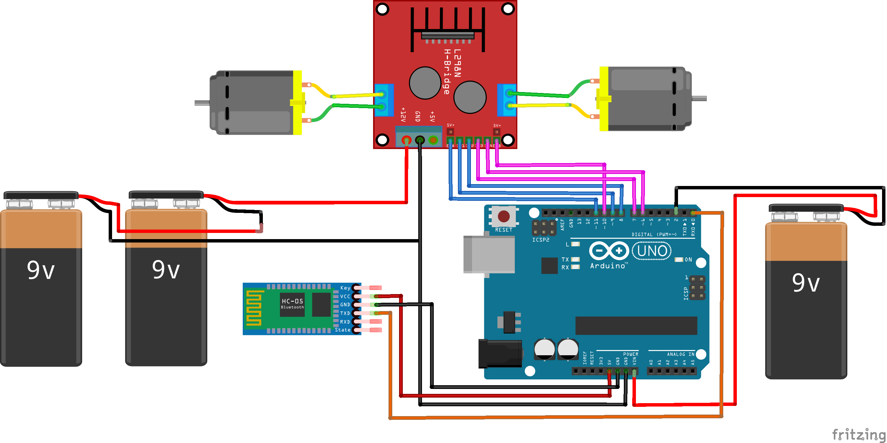

    

# Bluetooth Controlled Robo-Car

## Structure

- Description
- Components
- Circuit Diagram
- References

## Description

As a part of our University Curriculum, we made this project for Embedded Systems - CSCS 306. In this project, we designed and made a three-wheel robo-car that can be controlled through a mobile phone using the BlueTooth technology. We created a mobile application which controls the direction of movement of the car using an interface on the mobile phone. The car moves forward, backward, right and left using buttons on the mobile interface. If none of these buttons is pressed, the car stops. This project tested our abilities of interfacing different modules such as Bluetooth and Dual Motor Driver with the Arduino.

## Components

- A three wheel car chassis with motors
- Bluetooth module HC05
- Arduino Board
- Dual Motor Driver Module
- Smart Phone
- 9v Batteries

## Circuit Diagram

    

## References
- https://maker.pro/arduino/tutorial/bluetooth-basics-how-to-control-led-using-smartphone-arduino
- https://howtomechatronics.com/tutorials/arduino/arduino-dc-motor-control-tutorial-l298n-pwm-h-bridge/
- https://stackoverflow.com/questions/39964718/virtual-joystick-in-android-sdk
- https://www.tutorialspoint.com/android/android_button_control.htm
- https://www.tutorialspoint.com/android/android_bluetooth.htm
- https://fritzing.org/

# Contributors

Do check the contributor to follow some awesome projects

- [@mohammadusman666](https://github.com/mohammadusman666)
- [@abeer04](https://github.com/abeer04)

`Feel free to fork the repository and contribute to this project.`
